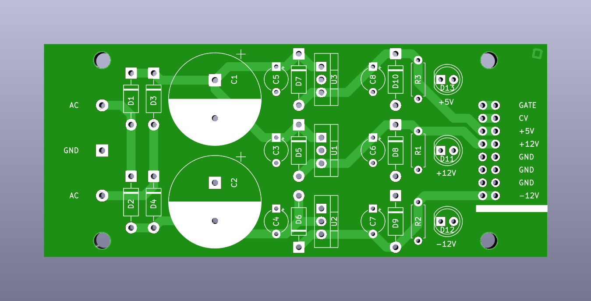
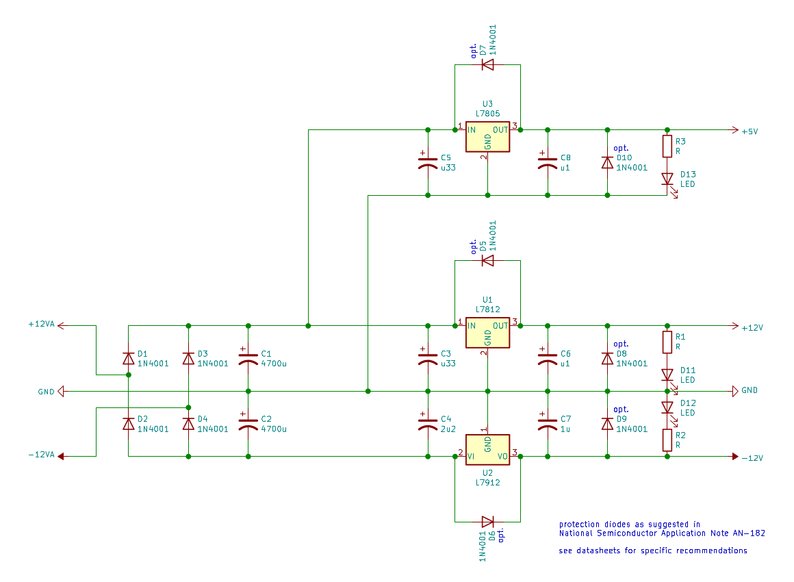

# Basic Bipolar Input Eurorack Power Supply

This power supply derives +12 V, -12 V and +5 V from +12 V AC and -12 V AC with a common GND (same phase, as found on a center-tapped 24 V transformer). It is intended as a cheap and simple bipolar (plus 5 V) power supply for modular synthesizers and general test setups.

The double-sided PCB layout is very straightforward. Two AC inputs plus GND coming in on the left and leaving rectified, filtered and regulated on the right.

To keep it as simple as possible the circuit only contains few non-essential components. 7812, 7912 and 7805 linear regulators are used in their basic fixed-voltage configuration (as suggested in the datasheets and used in many designs).

The diodes, voltage regulators and the (bipolar) AC supply used determine the amount of current this power supply can provide. Depending on the application additional fuses or protection diodes are recommended. If heatsinks are used on the linear regulators, they must not touch each other.

Components listed on the BOM are only loosely defined. They have to be specified/adapted to fit individual requirements (with preferably generous safety margins, e.g. capacitors rated 35 V for 12-15 V AC input).

Dimensions: 99.06 x 41.91 mm

Mounting hole pattern: 76.2 x 35.56 (~3 mm hole diameter)

The PCB files are licensed under a [Creative Commons Attribution-NonCommercial-ShareAlike 4.0 International License](https://creativecommons.org/licenses/by-nc-sa/4.0/).
